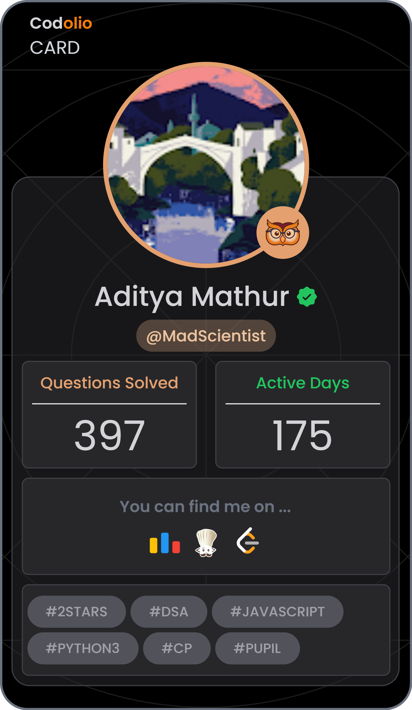

<h1 align="center">Hi, I'm Aditya Mathur 👋</h1>

<h3 align="center">
Full-stack developer focused on backend systems, AI-powered products, and scalable web applications.
</h3>

I enjoy building real-time systems, automation pipelines, AI workflows, and developer-focused tooling.

---

## 👨‍💻 About Me

- 🎓 Graduated from Manipal Institute of Technology in Information Technology (2026)
- 🔭 Currently building AI-powered developer and recruiter tooling
- 🌱 Exploring distributed systems, AI agents, and scalable backend architecture
- ⚡ Interested in system design, backend engineering, and product-focused development
- 🏆 Winner of Best Hack Award at Manipal Hackathon
- 📫 Reach me at: **aditya.mathur5885@gmail.com**

---

## ⚡ Tech Stack

### Languages

### Backend & Frontend

### Databases

### Cloud & DevOps

### Tools

---

# 🚀 Featured Projects

## 🤖 RFP BidAssist AI

AI-powered platform that automates government RFP analysis and recommends enterprise products using intelligent document processing and semantic matching.

### Highlights
- OCR + document extraction pipelines
- AI-assisted requirement analysis
- Enterprise product recommendation engine
- Scalable backend workflows

🔗 Repo:  
https://github.com/MadScientistt4/RFP-BidAssist-AI

---

## ⚽ GoalConnect

Real-time football platform with live chat, scraping pipelines, authentication, and payment integration.

🏆 Winner, Best Hack Award at Manipal Hackathon

### Highlights
- Real-time messaging with Socket.io
- Secure authentication & payment integration
- Automated football data pipelines
- Responsive full-stack architecture

🔗 Repo:  
https://github.com/MadScientistt4/Goal-Connect

🌐 Live:  
https://goal-connect-nu.vercel.app/

---

## 🧠 Currently Exploring

- Distributed systems
- AI agents & LLM workflows
- System design
- High-performance backend architecture

---

## 📊 GitHub Stats

---

## 🧩 Competitive Programming

  

  

  

  

---

## 🌐 Connect With Me

  

  

  

---

Thanks for stopping by! Feel free to explore my repositories and projects 🚀

